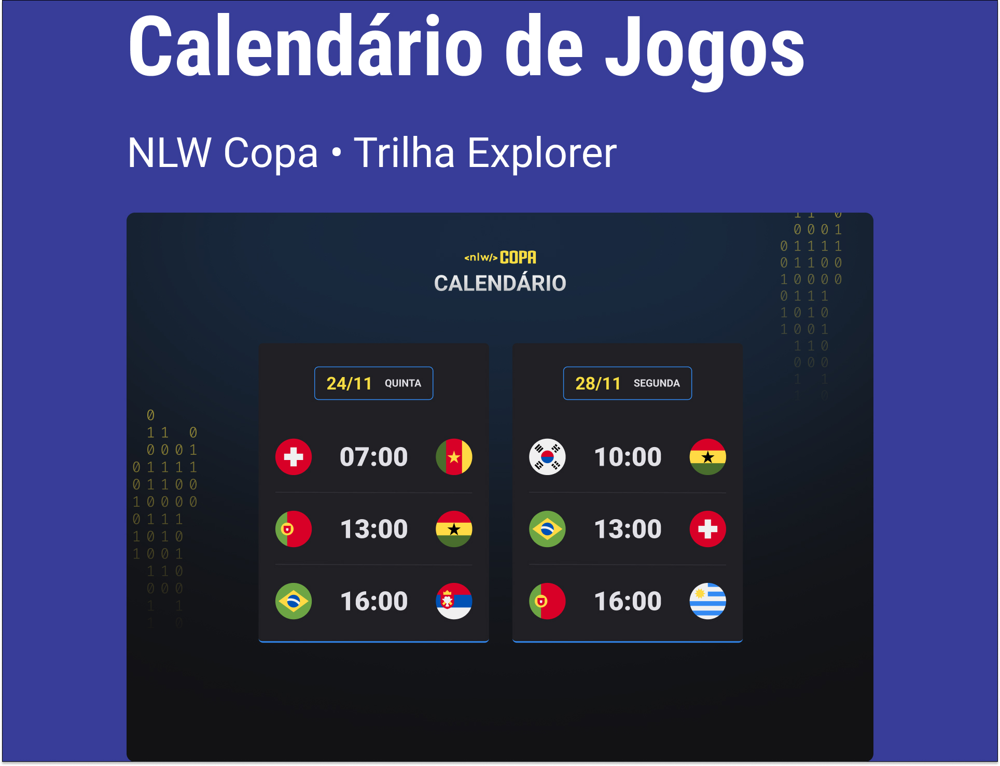

<h1 align="center"> NLW #10 Copa </h1>

 Projeto da semana NLW RocketSeat 

  <a href="#-tecnologias">Tecnologias</a>&nbsp;&nbsp;&nbsp;|&nbsp;&nbsp;&nbsp;
  <a href="#-projeto">Projeto</a>&nbsp;&nbsp;&nbsp;|&nbsp;&nbsp;&nbsp;
  <a href="#-layout">Layout</a>&nbsp;&nbsp;&nbsp;|&nbsp;&nbsp;&nbsp;
  <a href="#-memo-licenca">Licença</a>

 
 

 

## Tecnologias

Este projeto foi desenvolvido com as seguintes tecnologias:

- HTML e CSS
- JavaScript
- Git e GitHub
